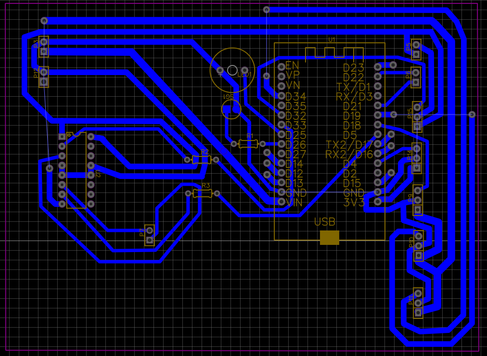
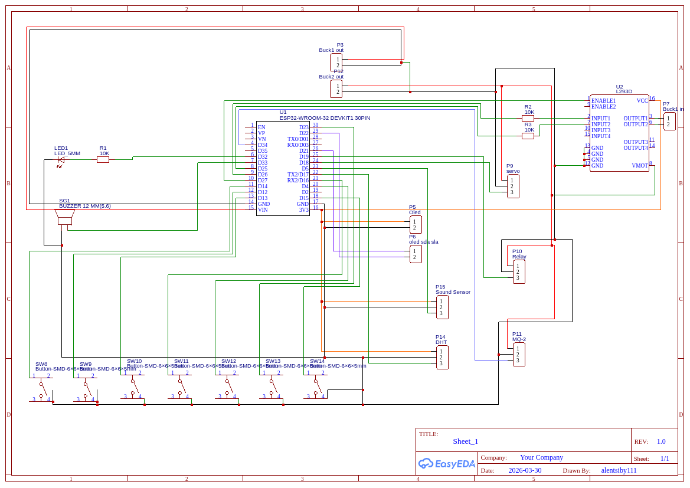

# SmartStove Controller

A fully featured, IoT-enabled automated stove controller built with an ESP32. This system automatically manages a gas stove by physically manipulating the knob and igniter, monitoring temperature, checking for gas leaks, and detecting pressure cooker whistles.



## Features

- **IoT Connectivity:** Full integration with the Blynk App for remote monitoring and control.
- **Automated Ignition:** Uses an L293D motor driver and servo to physically turn the gas knob, wait for gas release, spark the igniter, and confirm ignition via temperature rise.
- **Safety Systems:**
  - **Gas Leak Detection:** Uses an MQ2 gas sensor to constantly monitor the environment. Shuts off gas automatically if a leak is detected and triggers visual/audible alarms.
  - **Flame Verification:** Confirms the stove successfully ignited by monitoring the initial temperature spike using a DHT11 sensor.
  - **Deadman Switch:** Automatically turns the stove off after 2 hours as a failsafe.
- **Whistle Counting:** Counts pressure cooker whistles using an acoustic sensor and automatically shuts down after reaching a user-defined target.
- **Timer functionality:** Granular control over cooking time, locally or via app.
- **OLED Display:** Real-time feedback for timer, temperature, gas levels, and system status on an SSD1306 display.

## Hardware Structure

- **ESP32 Microcontroller** as the main brain.
- **L293D Motor Driver** for controlling the ignition motor mechanism.
- **Servo Motor** for precise flame level control (Low, Medium, High).
- **Relay Module** for toggling the lighter/sparker.
- **DHT11 Sensor** for ambient and ignition-verification temperature.
- **MQ2 Sensor** for hazardous gas monitoring.
- **Sound Sensor** for pressure cooker whistle detection.
- **SSD1306 OLED Display (128x64)** for local UI.
- **Physical Interface:** Assorted pushbuttons for power, timer control, whistle setting, and flame level adjustments.

## Repository Structure

```
.
├── docs/
│   └── assets/           # Images (Schematic, PCB renders)
├── hardware/             # Hardware design files (PDFs)
├── src/
│   └── SmartStove/       # ESP32 Arduino source code
├── .gitignore
├── LICENSE
└── README.md
```

## Getting Started

### Prerequisites

You need the following installed in your Arduino IDE:
- ESP32 Board Manager
- [Blynk library](https://github.com/blynkkk/blynk-library)
- [Adafruit GFX Library](https://github.com/adafruit/Adafruit-GFX-Library)
- [Adafruit SSD1306](https://github.com/adafruit/Adafruit_SSD1306)
- [ESP32Servo](https://github.com/madhephaestus/ESP32Servo)
- [DHT sensor library](https://github.com/adafruit/DHT-sensor-library)

### Setup

1. Open `src/SmartStove/SmartStove.ino` in your Arduino IDE.
2. Replace the WiFi and Blynk placeholders with your actual credentials:
   ```cpp
   #define BLYNK_TEMPLATE_ID "YourTemplateID"
   #define BLYNK_AUTH_TOKEN "YourAuthToken"
   
   char ssid[] = "YourWiFiName";
   char pass[] = "YourWiFiPassword";
   ```
3. Connect your ESP32, select the appropriate COM port, and upload the code.

## Circuit & PCB

You can find the schematic and PCB files in the `docs/assets/` and `hardware/` folders.

- **Schematic**: `docs/assets/schematic.png`
- **PCB Design**: `docs/assets/pcb_design_bw.png`
- **PCB Document**: `hardware/SmartStove_PCB.pdf`



## License

This project is licensed under the MIT License - see the [LICENSE](LICENSE) file for details.
